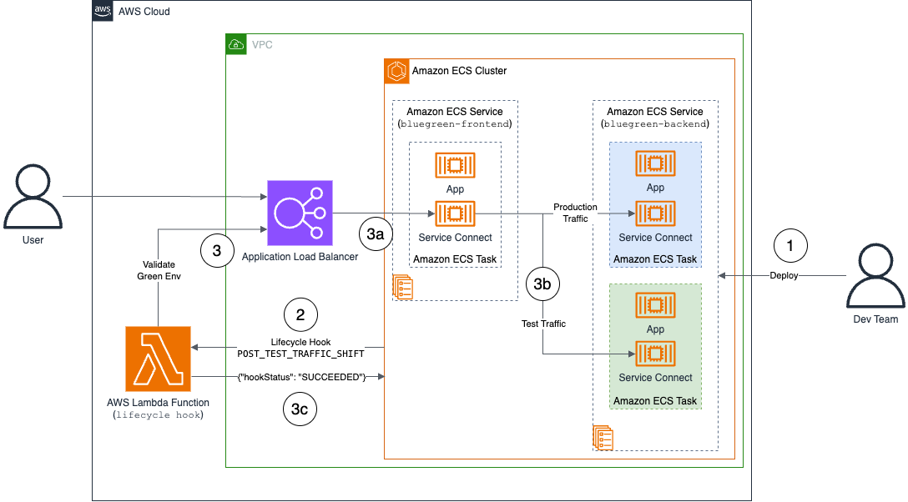

# Blue/Green Deployment with Amazon ECS Service Connect

This project demonstrates how to implement blue/green deployments with Amazon ECS Service Connect using AWS CDK. It creates the necessary infrastructure for testing and validating deployments.

## Overview

To show the capabilities of the blue/green deployment with Amazon ECS Service Connect we are going to deploy the following architecture



- [AWS Lambda function](https://docs.aws.amazon.com/lambda/latest/dg/welcome.html) to validate the test traffic
- [Application Load Balancer](https://docs.aws.amazon.com/elasticloadbalancing/latest/application/introduction.html) to expose the application frontend
- [Amazon ECS Cluster](https://docs.aws.amazon.com/AmazonECS/latest/developerguide/clusters.html) to deploy the application running on 2 different services `bluegreen-fronent` and `bluegreen-backend` both running [Service Connect](https://docs.aws.amazon.com/AmazonECS/latest/developerguide/service-connect.html)

In this example we are going to deploy a blue and green version of the `bluegreen-backend` service by leveraging the blue/green feature of Amazon ECS with Service Connect. 

### CDK Resources

Here the list of main AWS resources that are going to be deployed with the CDK stack:

- Amazon Virtual Private Cloud (Amazon VPC) with public and private subnets
- NAT Gateways for private subnet connectivity
- Security Groups for Application Load Balancer, Frontend Tasks and Backend Tasks
- Application Load Balancer with Target Group and 
Listeners on port 80
- AWS IAM Roles and Permissions
- Amazon CloudWatch Log Group 
- AWS Lambda functions to validate the test traffic

## Prerequisites

- AWS Command Line Interface (AWS CLI) configured with appropriate credentials
- Node.js and [npm](https://www.npmjs.com/) installed
- AWS Cloud Development Kit (AWS CDK) installed (`npm install -g aws-cdk`)
- [`jq`](https://jqlang.org/) library to parse json
- Python3 and pip installed

## Getting Started

1. Install dependencies:

```bash
npm install
```

2. Build the AWS Lambda function:

```bash
sh build-lambda-zip.sh
```

3. Setup your AWS CDK environment and Deploy the AWS CDK Stack:

```bash
cdk bootstrap
cdk deploy
```

## Customizing Parameters (Optional)

You can customize the deployment by providing context parameters:

```bash
cdk bootstrap --context region=us-east-1
cdk deploy --context yourIpAddress=x.x.x.x/32 --context region=us-east-1
```

Available parameters:

- `yourIpAddress`: Your IP address for ALB security group (default 0.0.0.0/0)
- `region`: AWS region to deploy to (default: us-west-2)

## Walkthrough

### Create the demo environment

1. Load the environment variables from the AWS CloudFormation Stack:

```bash
source load-env-variables.sh
```

2. Create the demo setup environments and populate all the required templates for Amazon ECS Task Definitions and Amazon ECS Services:

```bash
sh demo-setup.sh
```

### Check the application

Verify that the application is running the `Blue Version`:

```bash
curl -s $ALB_DNS | grep "Blue Version"
```

### Create an updated task definition with the updated version

1. Create the Amazon ECS task definitions with the green version:

```bash
aws ecs register-task-definition \
    --region $REGION \
    --cli-input-json file://outputs/taskdef_backend_update.json
```

2. Update the Amazon ECS Service with the green version:

```bash
aws ecs update-service \
    --region $REGION \
    --service bluegreen-backend \
    --force-new-deployment \
    --cli-input-json file://outputs/service_backend_update.json
```

3. Wait until the deployment is completed:

```bash
aws ecs wait services-stable \
    --region $REGION \
    --cluster $ECS_CLUSTER_NAME \
    --services bluegreen-backend
```

### Check the updated version of the application

Verify that the application is running the `Green Version`:

```bash
curl -s $ALB_DNS | grep "Green Version"
```

### Cleanup

Remove the resources created by the `demo-setup.sh` script:

```bash
sh demo-teardown.sh
```

Remove the resources created by the AWS CDK Stack:

```bash
cdk destroy
```
